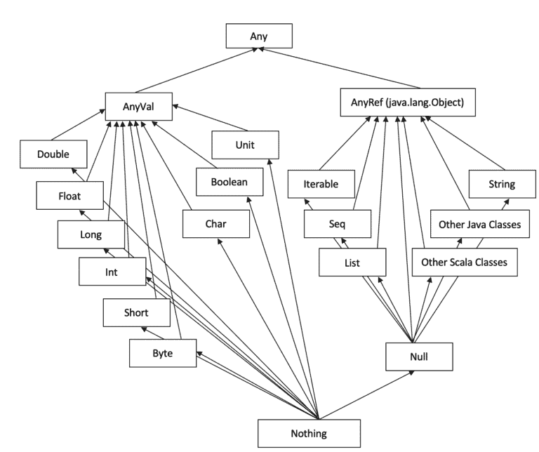

# Scala
### 1.	What is a trait ? when to use ?  example
> Traits cannot be instantiated but it can be interited by other traits or classes.  Also, one trait can inherit from one class but multiple traits. If multiple traits have the same method, when we call the method, we will call the method from the last trait. With trait we can avoid diamond error.

### 2.	Difference between trait and sealed trait?
> A sealed trait can only be extended in the same file where it was defined.

3.	What is an abstract class? 
> An abstract class is a class whose variables or methods are declared but not specified or implemented. Thus an abstract class cannot be initiated. Usually an abstract class should be inherited, can specification or implmentation of the variables and methods are given in the subclasses.

4.	What is the difference between  java interface and a scala trait?
>  Methods in Scala traits can be either abstract or non-abstract, but in Java, it has to be abstract. Scala traits admit constructor parameters, but Java interfaces don't. 

5.	What is a singleton?
> In Scala a singleton is a class that has at most one instance. It's defined with keyword __object__. The instance is created lazily only when being referenced somewhere else. Singletons don't have constructors.

6.	What is a higher order function?

> A function in scala is called higher order if it meets at least one of the following:
>- Some parameters of it are functions.
>- The function returns a function

7.	What is a closure function?
> In Scala, a closure is a function whose return value depends on some variable(s) defined outside the function.

8.	What is a companion object? What are the advantages ? example

> When a singleton shares the same name with a class, it's called that class's companion object. 

>Both the singleton and the class have to be defined in the same source file. 

>The companion object and the class can access each other's members, even private.

9.	Nil vs Null vs null vs Nothing vs None vs Unit 
> __*null*__ represents the absent value of a reference that is not referring to any object.

> __*Null*__ is the type of **null**, which extends all traits and classes, which allows us to use **null** value for any reference type. **Null** is a _final_ abstract class, which cannot be extended or instatiated, and **null** the one and the only one instance of **Null** 

> __*Nil*__ is the an empty singleton object that extends _List_ type. It's often used to initialize empty lists.

>__*None*__ is a subtype of _option_ type.

>__*Unit*__ is the return type of functions returning nothing.

>__*final class*__

>__*option type*__

10.	What is pure function?

> In Scala, a pure function is a function that
>- always returns the same value for the same arguments.
>- never modifies variables outside.
>- never read variables other than arguments and follow an internal algorithm to produce output.

11.	What is SBT and how have you used it? 

> SBT is the first build tool which was created specifically for Scala.

12.	What is currying?

> Currying is the process of converting a function with multiple arguments into a sequence of functions taking one argument. Each function returns another function that consumes the following argument.

13.	Difference between currying and higher-order functions.

>- A higher order function takes functions as arguments or returns functions. It may or may not be curries.
>- A currying function always returns a function.

14.	Difference between var and val?

> __*var*__ declares a mutable variable while __*val*__ declares an immutable variable.

15.	What is case class?
> In Scala constructor parameters in case classes are immutable by default. It can be declared and instantiated in a simple way.

```
case class CovidCountryStats(countryCode: String, deaths: Int, confirmedCases: Int)

val covidPL = CovidCountryStats("PL", 7
76, 15366)
```
>Unlike common classes, equal comparisons of case classes are based on their structure, NOT their references. It can also be used in pattern matching.

>Case classes come automatically with _hachcode_, _toString_and _equals_ method.

16.	Why/when to use case class? Example

> When we want to use pattern matching, or have immutable classes.

17.	Difference between case class and normal class?

> Case classes are immutable.

18.	Scala type hierarchy?




19.	What are partially applied functions?

> Partially applied functions are functions that are not applied on all parameters. This can reduce a function with many parameters to functions with less parameters. For parameters that are not passed to the function, we use underscore(_) as placeholder.

A partially applied function can replace any number of functions defined by the function.

20.	What is tail recursion.

> A recursion function is said to be a tail recursion if the recursion is the last procedure within the function.